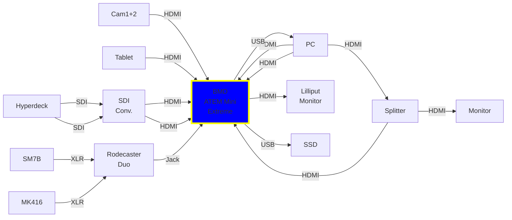

# About Me

::left::


::right::

````md magic-move
```java
Person me = new Person.Builder()
  .name("Mathias Ewald")
  .role("Solutions Architect")
  .company("GitLab")
  .build()
```
```java
Person me = new Person.Builder()
  .name("Mathias Ewald")
  .role("Solutions Architect")
  .company("GitLab")
  .contact(ContactDetails.Builder()
    .email("mewald@gitlab.com")
    .linkedin("mathias-ewald")
    .tel("+436641486171")
  )
  .build()
```
```java
Person me = new Person.Builder()
  .name("Mathias Ewald")
  .role("Solutions Architect")
  .company("GitLab")
  .contact(ContactDetails.Builder()
    .email("mewald@gitlab.com")
    .linkedin("mathias-ewald")
    .tel("+436641486171")
  ).skills(Set.of(
     "Developer Platforms", "DevSecOps",
     "SpringBoot", "Kubernetes", "AI/ML"
  ))
  .build();
```
```java
Person me = new Person.Builder()
  .name("Mathias Ewald")
  .role("Solutions Architect")
  .company("GitLab")
  .contact(ContactDetails.Builder()
    .email("mewald@gitlab.com")
    .linkedin("mathias-ewald")
    .tel("+436641486171")
  ).skills(Set.of(
     "Developer Platforms", "DevSecOps",
     "SpringBoot", "Kubernetes", "AI/ML"
  ))
  .interests(Set.of("Basketball", "Running", "Smart Home")
  .pets(List.of("Dog", "Chicken"))
  .married(true).children(1)
  .build();
```
````

---
layout: image-left
image: /desk.jpg
---
- 2x Sony Alpha 6400
- Shure SM7B
- Sennheiser MK 416
- <span v-mark="{ at: 1, color: 'yellow', type: 'circle' }">BMD ATEM Mini Extreme</span>
- RODE Rodecaster Duo
- Glide Gear Teleprompter
- Lilliput Field Monitor
- BMD Hyperdeck Studio HD Plus
- Elgato StreamDecks
- 2x Elgato KeyLight
- Elgato Wave Arm LP
- Apple Mac Mini Studio
- Samsung Galaxy Tab S9
- Elgato Green Screen Rollup
- Some mounting gear
---
layout: center
---

---