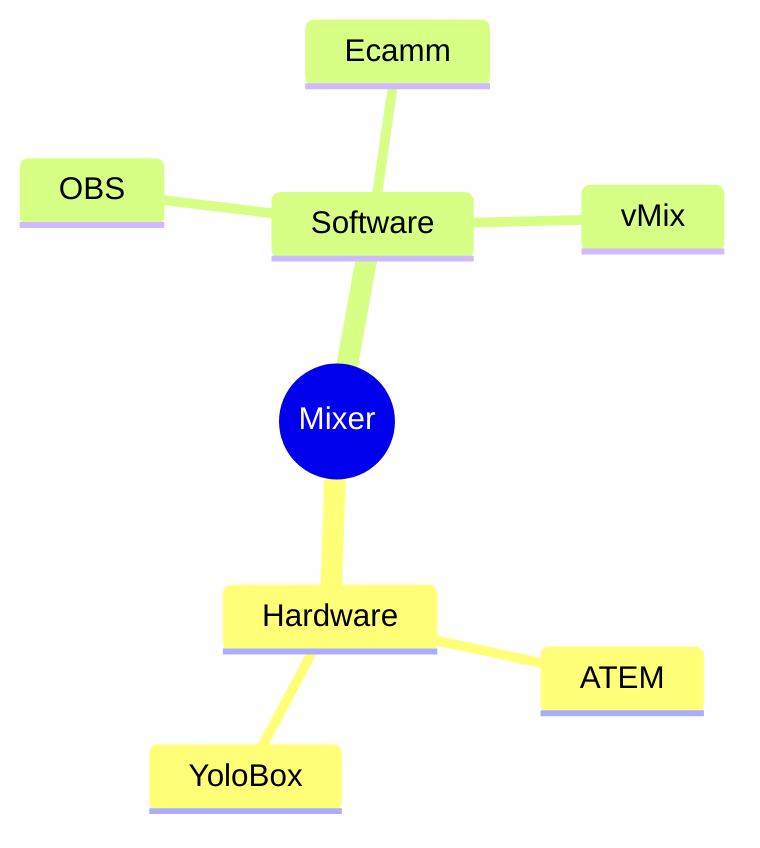

# Why Anything?

---
layout: image-left
image: home-office.jpg
---

# Remote Job

- <mdi-presentation class="text-xl text-red-400" style="vertical-align: middle;" /> Pitches
- <mdi-microsoft-teams class="text-xl text-green-400" style="vertical-align: middle;" /> Workshops
- <mdi-human-male-board class="text-xl text-blue-400" style="vertical-align: middle;" /> Training
- <mdi-video-outline  class="text-xl text-red-400" style="vertical-align: middle;"/> Recording
- <mdi-account-group class="text-xl text-pink-400" style="vertical-align: middle;" /> Internal Meetings

 

<v-click>
    <mdi-arrow-right-bold />
    Optimize for these situations!
</v-click>

 
 
 

<v-click>
Quality, Effects, Variety
</v-click>

---
layout: image-right
image: laptop.png
backgroundSize: 70%
---
# Everybody starts here

- <mdi-laptop class="text-xl text-blue-400" style="vertical-align: middle;" /> Laptop
- <mdi-microphone class="text-xl text-orange-400" style="vertical-align: middle;" /> Microphone
- <mdi-camera-outline class="text-xl text-pink-400" style="vertical-align: middle;" /> Camera
- <mdi-speaker class="text-xl text-green-400" style="vertical-align: middle;" /> Speakers

 

<v-click>

It works, but is this "optimized"?
</v-click>

<v-clicks>

- Bad video quality
- Low video angle
- Terrible audio quality
- Low variety

</v-clicks>

---
layout: cover
background: software-developer.jpg
---
# Demo
---
layout: section
---
# Why Hardware?
---
layout: two-cols-header
---
# Quick Comparison 

::left::

::right::

## Software
- <mdi-thumbs-up class="text-green-400"/> Good quality (given a good mic and webcam)
- <mdi-thumbs-up class="text-green-400"/> High variety
- <mdi-thumbs-down class="text-red-400" /> High load
- <mdi-thumbs-down class="text-red-400" /> Compatiblity issues

## Hardware
- <mdi-thumbs-up class="text-green-400"/> Excellent quality (especially for recordings)
- <mdi-thumbs-up class="text-green-400"/> Medium variety (throw more hardware at it)
- <mdi-thumbs-up class="text-green-400" /> Offloading
- <mdi-thumbs-down class="text-red-400" /> Price
- <mdi-thumbs-down class="text-red-400" /> Mobility
---