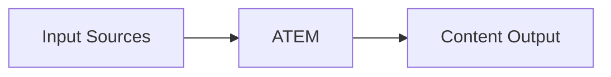
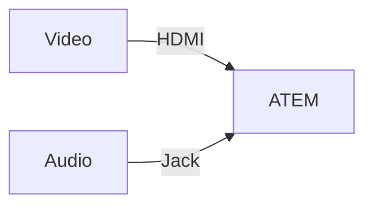
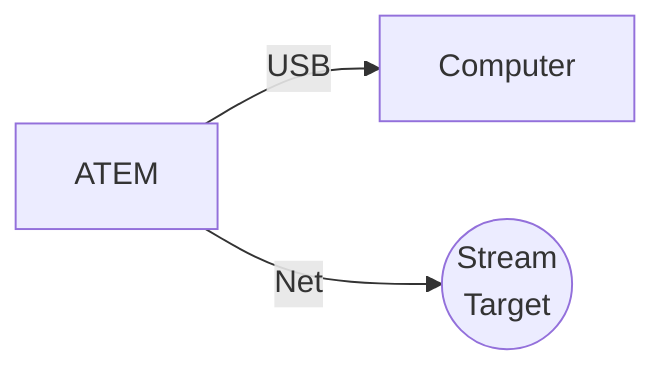

# How It Works
---
layout: none
---
<SlidevVideo autoplay style="width: 100%">
  <source src="/switcher.hd.1080p.mp4" type="video/mp4" />
  

    Your browser does not support videos. You may download it
    <a href="/switcher.hd.1080p.mp4">here</a>.
  

</SlidevVideo>

---
layout: default
---
# Big Picture

---
layout: two-cols-header
---
# Input Sources
Takes inputs for processing

::left::

## Video, e.g.
- Camera
- Computer
- Tablet

## Audio, e.g.
- Microphone
- Audio Interface

 
 

::right::

---
layout: two-cols-header
layoutClass: gap-16
---

# Content Output
Mixes inputs into a single output

::left::

::right::

## Webcam, e.g.
- Zoom
- Google Meet
- Teams

## Streaming, e.g.
- YouTube
- LinkedIn
---