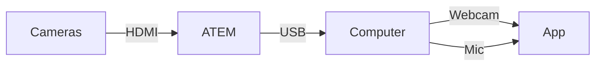
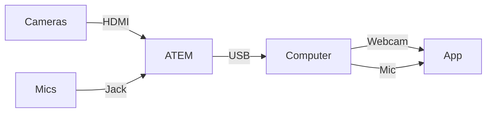

# How It Works
---
layout: none
---
<SlidevVideo autoplay controls="false" style="width: 100%">
  <source src="/switcher.hd.1080p.mp4" type="video/mp4" />
  

    Your browser does not support videos. You may download it
    <a href="/switcher.hd.1080p.mp4">here</a>.
  

</SlidevVideo>
---
layout: center
---

<v-switch>
  <template #0>

  </template>
  <template #1>

  </template>
</v-switch>

---