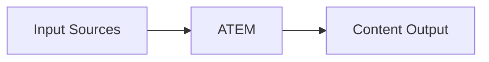
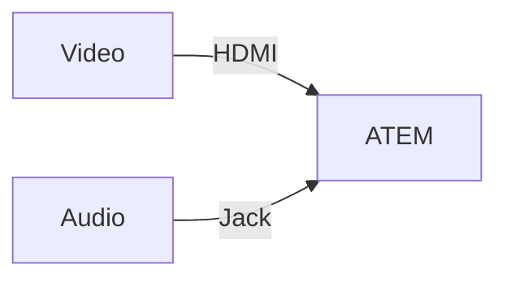
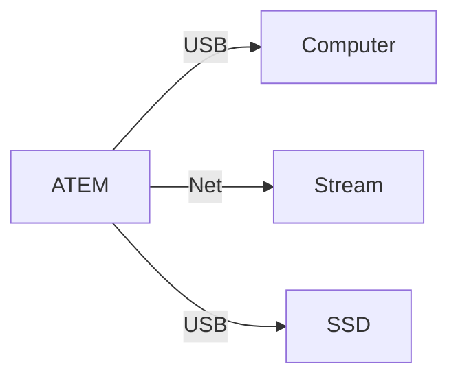

# How It Works
---
layout: none
---
<SlidevVideo autoplay style="width: 100%">
  <source src="/switcher.hd.1080p.mp4" type="video/mp4" />
  

    Your browser does not support videos. You may download it
    <a href="/switcher.hd.1080p.mp4">here</a>.
  

</SlidevVideo>

---
layout: default
---
# Big Picture

---
layout: two-cols-header
---
# Input Sources
Takes inputs for processing

::left::

## Video, e.g.
- Camera
- Computer
- Tablet

## Audio, e.g.
- Microphone
- Audio Interface

 
 

::right::

---
layout: two-cols-header
layoutClass: gap-16
---

# Content Output
Mixes inputs into a single output

::left::

::right::

## Webcam, e.g.
- Zoom
- Google Meet
- Teams

## Streaming, e.g.
- YouTube
- LinkedIn
---
layout: two-cols
---
# Function Primitives
Basic functions can be combined

 

## Video

- Transitions (Cut, Mix, Wipe, Dip, DVE, Stinger1)
- Upstream Key (Luma, Chroma, Pattern, DVE)
- Downstream Key (Bugs, Logos, Lower Thirds)
- Media Player (Images, Clips1)
- Super Source 2
- Color Generators

 

## Audio

- Equalizer (6 band)
- Dynamics (Expander, Gate, Compressor, Limiter)

[1]: ATEM Constellation or higher 
[2]: ATEM Mini Extreme or higher

::right::

    <figure style="width: 50%">
        
        <figcaption style="font-size: 50%; text-align: center;">Green screen with Chroma Key</figcaption>
    </figure>
    <figure style="width: 50%">
        
        <figcaption style="font-size: 50%; text-align: center;">Logo with Downstream Key</figcaption>
    </figure>

---
---
# Transitions
Basic Examples

   <SlidevVideo autoplay loop><source src="/cut.mp4" type="video/mp4" /></SlidevVideo>
   <SlidevVideo autoplay loop><source src="/mix.mp4" type="video/mp4" /></SlidevVideo>
   <SlidevVideo autoplay loop><source src="/dip.mp4" type="video/mp4" /></SlidevVideo>
   <SlidevVideo autoplay loop><source src="/wipe.mp4" type="video/mp4" /></SlidevVideo>
   <SlidevVideo autoplay loop><source src="/dve.mp4" type="video/mp4" /></SlidevVideo>

---