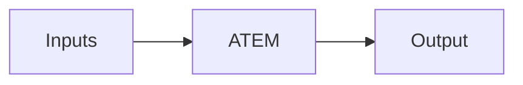
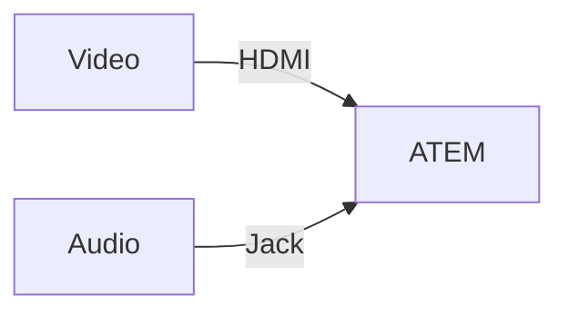
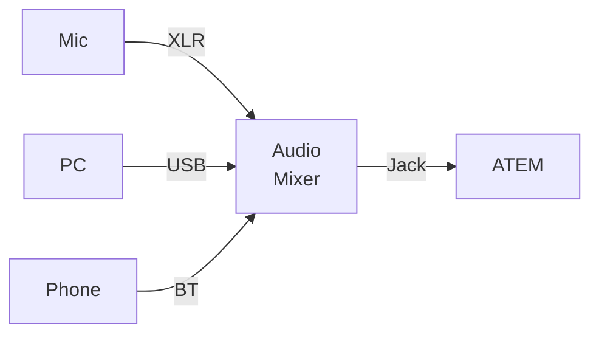
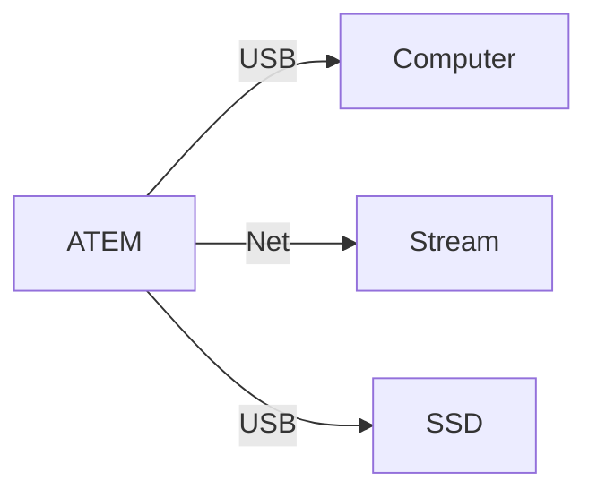

# How It Works
---
layout: none
---
<SlidevVideo autoplay style="width: 100%">
  <source src="/switcher.hd.1080p.mp4" type="video/mp4" />
  <p>
    Your browser does not support videos. You may download it
    <a href="/switcher.hd.1080p.mp4">here</a>.
  </p>
</SlidevVideo>

---
layout: default
---
# Big Picture

<div style="height: 100%; display: flex; flex-direction: row; justify-content: center; align-items: center">



</div>

---
layout: two-cols-header
---
# Input Sources
Takes inputs for processing

::left::

<div style="display: flex; flex-direction: row; gap: 50px;">

<div>

## Video
- Camera
- Computer
- Tablet

## Audio
- Microphone
- Audio Interface

</div>

<v-click>
<div>

<style>
li {
    line-height: 16px;
    padding-top: 8px;
    padding-bottom: 8px;
}
</style>

## Internal
- Color Generator
- Media Player<br/><span class="text-xs" style="color: grey;">(Images, Clips<sup>1</sup>)</span>
- Super Source<sup>2</sup>
</div>
</v-click>
</div>

<br/>

<div style="font-size: 60%; margin-top: 15px;">
[1]: Constellation or higher<br/>
[2]: Mini Extreme or higher<br/>
</div>

::right::



---
layout: two-cols
---
# Audio Interface
Takes inputs for processing

## Microphones
- High quality XLR inputs

## Others (optional)
- Bluetooth
- Computer

<br/>
<br/>
<br/>
<br/>

::right::


<div style="display: flex !important; flex-direction: column !important; align-items: center !important;">



<div style="display: flex !important; flex-direction: row !important; justify-content: center; align-items: center !important;">


</div>
</div>

---
layout: two-cols-header
layoutClass: gap-16
---

# Content Output
Mixes inputs into a single output

::left::



::right::

## Webcam, e.g.
- Zoom
- Google Meet
- Teams

## Streaming, e.g.
- YouTube
- LinkedIn
---
layout: two-cols
---

# Function Primitives
Basic functions can be combined

<style>
.footnotes-sep {
    visibility: hidden;
}
</style>

<br/>

## Video
- Transitions <span style="color: grey">(Cut, Mix, Wipe, Dip, DVE, Stinger<sup>1</sup>)</span>
- Upstream Key <span style="color: grey">(Luma, Chroma, Pattern, DVE)</span>
- Downstream Key <span style="color: grey">(Bugs, Logos, Lower Thirds)</span>

## Audio
- Equalizer <span style="color: grey">(6 band)</span>
- Dynamics <span style="color: grey">(Expander, Gate, Compressor, Limiter)</span>

<br/>

<div style="font-size: 60%; margin-top: 15px;">
[1]: ATEM Constellation or higher<br/>
</div>

::right::

<div style="display: flex; flex-direction: column; align-items: center; gap: 50px">
    <figure style="width: 50%">
        
        <figcaption style="font-size: 50%; text-align: center;">Green screen with Chroma Key</figcaption>
    </figure>
    <figure style="width: 50%">
        
        <figcaption style="font-size: 50%; text-align: center;">Logo with Downstream Key</figcaption>
    </figure>
</div>

---
---
# Transitions
Replace one input source with another

<div class="mt-10" style="width: 100%; display: grid; grid-template-columns: repeat(3,1fr); grid-template-rows: repeat(2,auto); grid-gap:20px 30px;">
    <div style="display: flex; flex-direction: column; align-items: center;">
        <SlidevVideo autoplay loop><source src="/cut.mp4" type="video/mp4" /></SlidevVideo>
        <span class="text-xs">Cut (None)</span>
    </div>
    <div style="display: flex; flex-direction: column; align-items: center;">
        <SlidevVideo autoplay loop><source src="/mix.mp4" type="video/mp4" /></SlidevVideo>
        <span class="text-xs">Mix</span>
    </div>
    <div style="display: flex; flex-direction: column; align-items: center;">
        <SlidevVideo autoplay loop><source src="/dip.mp4" type="video/mp4" /></SlidevVideo>
        <span class="text-xs">Dip (to black)</span>
    </div>
    <div style="display: flex; flex-direction: column; align-items: center;">
        <SlidevVideo autoplay loop><source src="/wipe.mp4" type="video/mp4" /></SlidevVideo>
        <span class="text-xs">Wipe (white circle)</span>
    </div>
    <div style="display: flex; flex-direction: column; align-items: center;">
        <SlidevVideo autoplay loop><source src="/dve.mp4" type="video/mp4" /></SlidevVideo>
        <span class="text-xs">DVE (up)</span>
    </div>
</div>
---
---
# Upstream & Downstream Keys
Layers that add transparency

<div class="mt-10" style="width: 100%; display: grid; grid-template-columns: repeat(3,1fr); grid-template-rows: repeat(2,auto); grid-gap:50px 30px;">
   <div style="display: flex; flex-direction: column; align-items: center;">
        <SlidevVideo autoplay loop><source src="/chroma.mp4" type="video/mp4" /></SlidevVideo>
        <span class="text-xs">Chroma (green screen)</span>
    </div>
    <div style="display: flex; flex-direction: column; align-items: center;">
        <SlidevVideo autoplay loop><source src="/pattern.mp4" type="video/mp4" /></SlidevVideo>
        <span class="text-xs">Pattern (Circle)</span>
    </div>
    <div style="display: flex; flex-direction: column; align-items: center;">
        <SlidevVideo autoplay loop><source src="/luma.mp4" type="video/mp4" /></SlidevVideo>
        <span class="text-xs">Luma (Black + Crop)</span>
    </div>
    <div style="display: flex; flex-direction: column; align-items: center;">
        <SlidevVideo autoplay loop><source src="/dve-key.mp4" type="video/mp4" /></SlidevVideo>
        <span class="text-xs">DVE (Shadow + Border)</span>
    </div>
</div>
---
layout: default
---
# Controlling The ATEM
<br/>

<div style="display: flex; flex-direction: row; gap: 20px; margin-bottom: -50px;">


</div>

<div style="display: flex; flex-direction: row; justify-content: center; z-index: 100;">

</div>
---
layout: default
---
# ATEM Macros
Image background with USK circle pattern

```xml {1|2-16|17-18}{lines:true}
<Op id="PreviewInput" mixEffectBlockIndex="0" input="MediaPlayer1"/>
<Op id="KeyType" mixEffectBlockIndex="0" keyIndex="0" type="Pattern"/>
<Op id="KeyFillInput" mixEffectBlockIndex="0" keyIndex="0" input="Camera1"/>
<Op id="PatternKeyPattern" mixEffectBlockIndex="0" keyIndex="0" pattern="CircleIris"/>
<Op id="PatternKeyInvert" mixEffectBlockIndex="0" keyIndex="0" invert="False"/>
<Op id="PatternKeySize" mixEffectBlockIndex="0" keyIndex="0" size="1.0"/>
<Op id="PatternKeySoftness" mixEffectBlockIndex="0" keyIndex="0" softness="0.0"/>
<Op id="PatternKeySymmetry" mixEffectBlockIndex="0" keyIndex="0" symmetry="0.8"/>
<Op id="PatternKeyXPosition" mixEffectBlockIndex="0" keyIndex="0" xPosition="0.5"/>
<Op id="PatternKeyYPosition" mixEffectBlockIndex="0" keyIndex="0" yPosition="0.5"/>
<Op id="KeyMaskEnable" mixEffectBlockIndex="0" keyIndex="0" enable="False"/>
<Op id="KeyFlyEnable" mixEffectBlockIndex="0" keyIndex="0" enable="True"/>
<Op id="DVEAndFlyKeyXPosition" mixEffectBlockIndex="0" keyIndex="0" xPosition="13.47"/>
<Op id="DVEAndFlyKeyYPosition" mixEffectBlockIndex="0" keyIndex="0" yPosition="-7.25"/>
<Op id="DVEAndFlyKeyXSize" mixEffectBlockIndex="0" keyIndex="0" xSize="0.61"/>
<Op id="DVEAndFlyKeyYSize" mixEffectBlockIndex="0" keyIndex="0" ySize="0.61"/>
<Op id="TransitionSource" mixEffectBlockIndex="0" source="Background, Key1"/>
<Op id="CutTransition" mixEffectBlockIndex="0"/>
```

---