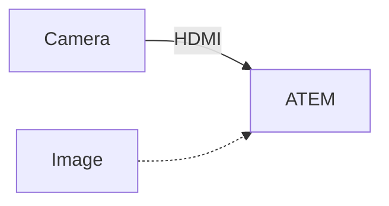
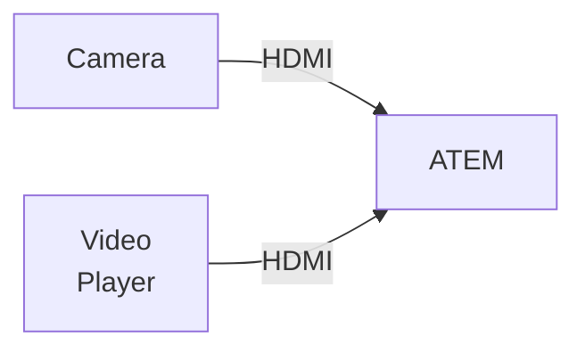
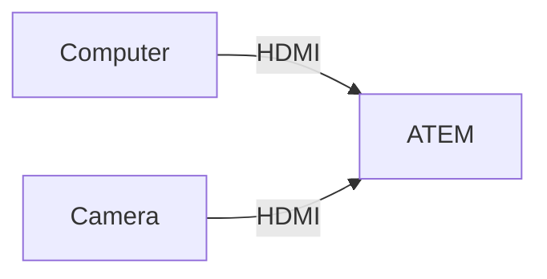
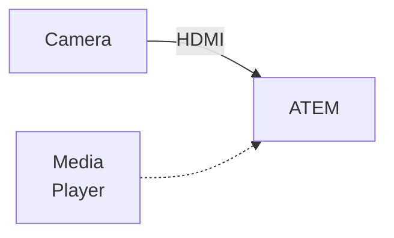
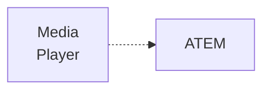
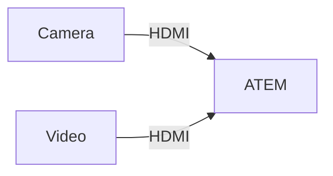

# Usecases
---
layout: two-cols-header
---
# Speaker w/ Static Background

::left::
## Prereqs
- Camera connected via HDMI
- Image loaded into Media Player

## Config
1. Load image into Media Player
2. Set Media Player as main input source
3. Enable Upstream Key with Camera input

::right::

---
layout: two-cols-header
---
# Speaker w/ Video Background

::left::
## Prereqs
- Camera connected via HDMI
- Video playing on another HDMI input
  - dedicated video player
  - 2nd screen with VLC player

## Config
1. Set video as main input source
2. Enable Upstream Key with Camera input

::right::

---
layout: two-cols-header
---
# Screen Sharing

::left::
## Prereqs
- Computer connected to ATEM
- Optional: Camera connected via HDMI

 

## Config A (USK)
1. Set computer screen as main input source
2. Optional: Enable Upstream Key with camera

 

## Config B (SSrc)
1. Enable SuperSource as main input
2. Configure box with computer screen
3. Optional: Configure box with camera input

::right::

---
layout: two-cols-header
---
# Green Screen (Virtual Background)

::left::
## Prereqs
- Camera connected to ATEM
- Background via MediaPlayer or HDMI
- Green screen behind the speaker
- Proper lighting

 

## Config
1. Set background as main input source
2. Enable Chroma USK and configure according to your current lighting situation

::right::

---
layout: two-cols-header
---
# Logo

::left::
## Prereqs
1. Create 1920x1080 image with transparency
2. Place logo in top right corner
3. Save as PNG

 

## Config
- Enable DSK with MediaPlayer as Fill/Key
- Configure DSK for image

::right::

---
layout: two-cols-header
---
# Lower Third

::left::

## Prereqs
- Create 1920x1080 video of lower third
- Play video on one of the HDMI inputs (ext. video player or 2nd monitor)

 

## Config
1. Enable DSK with video
2. Start video

 

Tip 1: Use image with a blend in effect 
Tip 2: [H2RGraphics](https://h2r.graphics/) 

::right::

