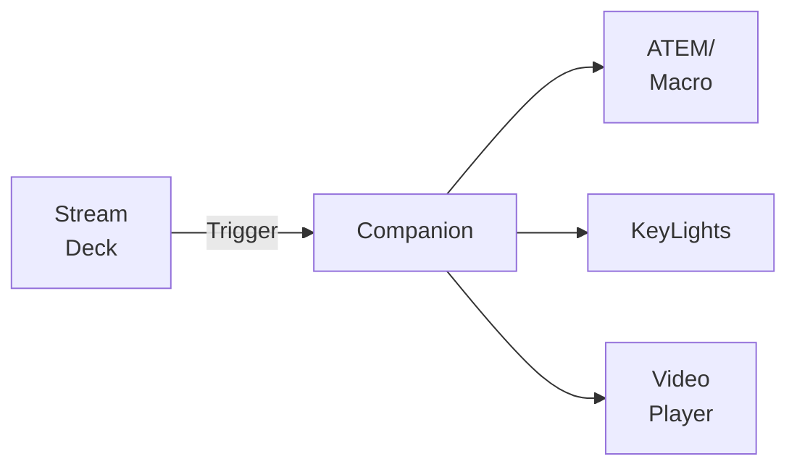
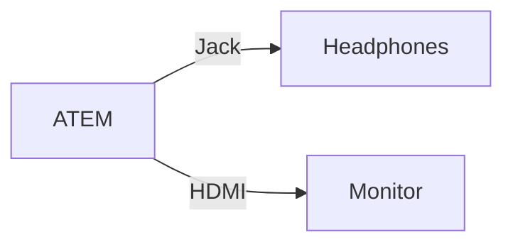

# Day 2
---
layout: default
layoutClass: gap-10
---
# Config Management - ATEM Macros
Record macros and run them from ATEM Software Control

 

---
layout: default
---

<h1 style="margin-bottom: 0;">meanstream.io</h1>
ATEM Macro Generator

 
 

<v-clicks>

</v-clicks>

---
layout: two-cols-header
layoutClass: gap-10
---
# Config Management
### Bitfocus Companion + Elgato StreamDeck

::left::

 

::right::

---
layout: two-cols-header
layoutClass: gap-10
---
# High Quality During Video Conferences

::left::

Different feeds at different settings
- Camera feed: low res, low fps
- Content sharing: high res, higher fps

 
<v-click>

> "Content from 2nd camera"

</v-click>

<v-click>
  

Availability depends on

- Application (Zoom, Teams, Google Meet, ...)
- Operating System (Linux, Mac, Windows)
- Platform (amd64, arm64, ...)

</v-click>

::right::

<v-click at="1">

</v-click>

---
layout: two-cols-header
layoutClass: gap-5
---
# Video/Audio Monitoring
How can I be sure the audience is seeing/hearing what I think they are?

::left::

- Is the ATEM configured correctly?
- Are people hearing the video I am playing?
- Is the audio level to high/low?

 

::right::

---