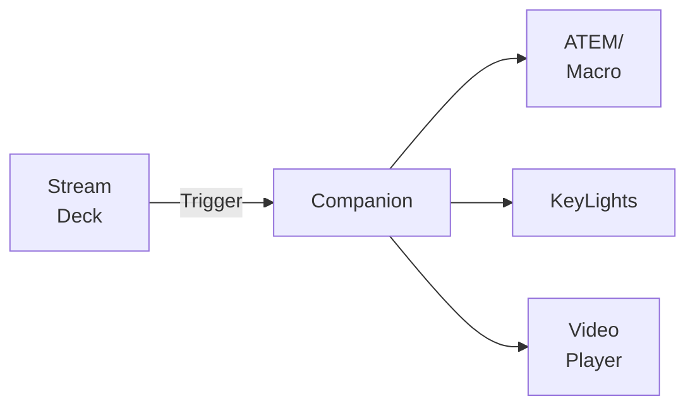
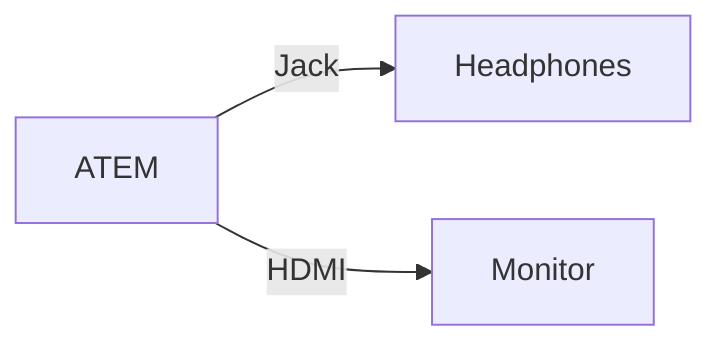

# Day 2
---
layout: default
layoutClass: gap-10
---
# Config Management
### ATEM Macros

<br/>

<div style="display: flex; flex-direction: row; gap: 10px; justify-content: start; align-items: start">


```xml {1|2-16|17-18}{class:'overflow-auto', lines:true}
<Op id="PreviewInput" mixEffectBlockIndex="0" input="MediaPlayer1"/>
<Op id="KeyType" mixEffectBlockIndex="0" keyIndex="0" type="Pattern"/>
<Op id="KeyFillInput" mixEffectBlockIndex="0" keyIndex="0" input="Camera1"/>
<Op id="PatternKeyPattern" mixEffectBlockIndex="0" keyIndex="0" pattern="CircleIris"/>
<Op id="PatternKeyInvert" mixEffectBlockIndex="0" keyIndex="0" invert="False"/>
<Op id="PatternKeySize" mixEffectBlockIndex="0" keyIndex="0" size="1.0"/>
<Op id="PatternKeySoftness" mixEffectBlockIndex="0" keyIndex="0" softness="0.0"/>
<Op id="PatternKeySymmetry" mixEffectBlockIndex="0" keyIndex="0" symmetry="0.8"/>
<Op id="PatternKeyXPosition" mixEffectBlockIndex="0" keyIndex="0" xPosition="0.5"/>
<Op id="PatternKeyYPosition" mixEffectBlockIndex="0" keyIndex="0" yPosition="0.5"/>
<Op id="KeyMaskEnable" mixEffectBlockIndex="0" keyIndex="0" enable="False"/>
<Op id="KeyFlyEnable" mixEffectBlockIndex="0" keyIndex="0" enable="True"/>
<Op id="DVEAndFlyKeyXPosition" mixEffectBlockIndex="0" keyIndex="0" xPosition="13.47"/>
<Op id="DVEAndFlyKeyYPosition" mixEffectBlockIndex="0" keyIndex="0" yPosition="-7.25"/>
<Op id="DVEAndFlyKeyXSize" mixEffectBlockIndex="0" keyIndex="0" xSize="0.61"/>
<Op id="DVEAndFlyKeyYSize" mixEffectBlockIndex="0" keyIndex="0" ySize="0.61"/>
<Op id="TransitionSource" mixEffectBlockIndex="0" source="Background, Key1"/>
<Op id="CutTransition" mixEffectBlockIndex="0"/>
```

</div>

---
layout: two-cols-header
layoutClass: gap-10
---
# Config Management
### Bitfocus Companion + Elgato StreamDeck

::left::

<br/>


::right::


---
layout: two-cols-header
layoutClass: gap-10
---
# High Quality During Video Conferences

::left::

Different feeds at different settings
- Camera feed: low res, low fps
- Content sharing: high res, higher fps

<br/>
<v-click>

> "Content from 2nd camera"

</v-click>


<v-click>
<br/><br/>

Availability depends on

- Application (Zoom, Teams, Google Meet, ...)
- Operating System (Linux, Mac, Windows)
- Platform (amd64, arm64, ...)

</v-click>

::right::

<v-click at="1">

</v-click>

---
layout: two-cols-header
layoutClass: gap-5
---
# Video/Audio Monitoring
How can I be sure the audience is seeing/hearing what I think they are?

::left::

- Is the ATEM configured correctly?
- Are people hearing the video I am playing?
- Is the audio level to high/low?

<br/>


::right::



---